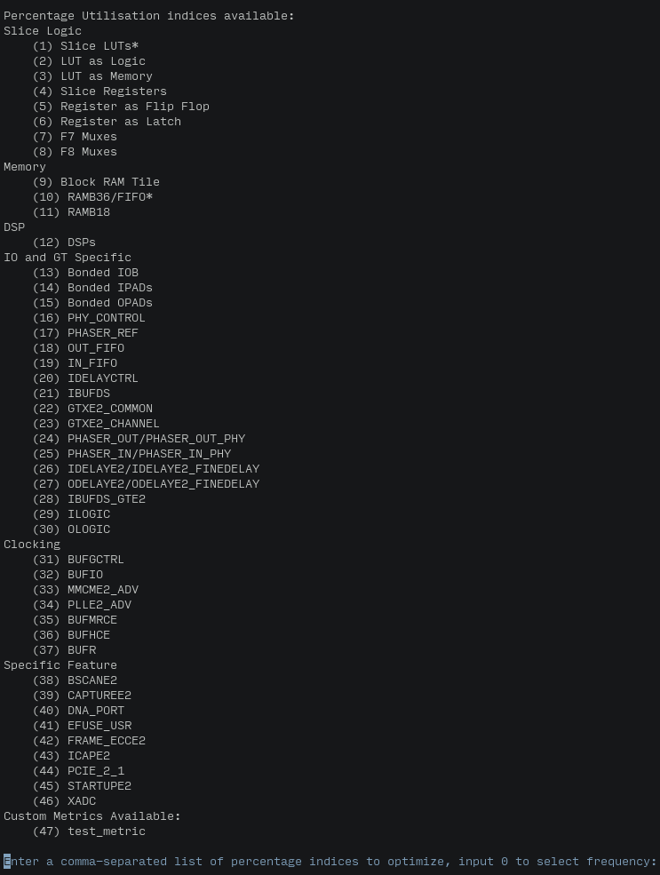

# Table of Contents

1.  [Installation](#org648fc4e)
2.  [Usage](#org4d8ab18)
    1.  [Defining Custom Metrics](#org023397d)
    2.  [Examples](#orge369aa6)
        1.  [neorv32 (VHDL)](#orgcb021dc)
        2.  [corundum (VERILOG)](#org9b66d30)
        3.  [cv32e40p (SYSTEM-VERILOG)](#orgbda061b)

DoVado is a RTL design automation and exploration CLI tool.

# Installation

DoVado needs python 3.6 or higher. Install it through pip, on many Linux systems use pip3 to force python 3 installation.

    pip3 install --user --no-cache dovado-rtl

# Usage

Dovado has two modes:

-   points: design automation mode in which a file containing parameter values must be given and a file containing all the evaluations is returned for some given metrics,
-   space: design exploration mode in which parameters and their ranges must be given together with some target metrics and the pareto set of design points with respect to the given metrics is returned.

<table border="2" cellspacing="0" cellpadding="6" rules="groups" frame="hsides">
<caption class="t-above">Table 1: dovado general parameters</caption>

<colgroup>
<col  class="org-left" />

<col  class="org-left" />

<col  class="org-left" />
</colgroup>
<thead>
<tr>
<th scope="col" class="org-left">parameter</th>
<th scope="col" class="org-left">description</th>
<th scope="col" class="org-left">mandatory</th>
</tr>
</thead>

<tbody>
<tr>
<td class="org-left">&#x2013;file-path</td>
<td class="org-left">path to the target file</td>
<td class="org-left">yes</td>
</tr>

<tr>
<td class="org-left">&#x2013;board</td>
<td class="org-left">vivado descriptor of a board</td>
<td class="org-left">yes</td>
</tr>

<tr>
<td class="org-left">&#x2013;parameters</td>
<td class="org-left">parameters to use either for points/space (integers and booleans supported)</td>
<td class="org-left">yes</td>
</tr>

<tr>
<td class="org-left">&#x2013;clock-port</td>
<td class="org-left">RTL identifier of the clock port</td>
<td class="org-left">yes</td>
</tr>

<tr>
<td class="org-left">&#x2013;implementation</td>
<td class="org-left">switch to evaluate designs after implementation (default is after synthesis)</td>
<td class="org-left">no</td>
</tr>

<tr>
<td class="org-left">&#x2013;incremental</td>
<td class="org-left">switch to use incremental synthesis/implementation</td>
<td class="org-left">no</td>
</tr>

<tr>
<td class="org-left">&#x2013;directives</td>
<td class="org-left">list of directives to pass to synthesis, place and route (default is RuntimeOptimized for all three)</td>
<td class="org-left">no</td>
</tr>

<tr>
<td class="org-left">&#x2013;target-clock</td>
<td class="org-left">clock (Mhz) to give as a constraint to Vivado (default=1000)</td>
<td class="org-left">no</td>
</tr>

<tr>
<td class="org-left">&#x2013;metrics</td>
<td class="org-left">list of metrics to target using their integer identifier (default mode is interactive, you will be asked after first synthesis/implementation)</td>
<td class="org-left">no</td>
</tr>

<tr>
<td class="org-left">&#xa0;</td>
<td class="org-left">&#xa0;</td>
<td class="org-left">&#xa0;</td>
</tr>
</tbody>
</table>

After those parameters specify points/space both these modes take an argument:

-   points argument: specify the path to the csv file containing the design points to be analyzed. The csv file must contain on each line the value for each of the parameters stated through &#x2013;parameters in the same order,
-   space argument: a list of ranges stated as 1 2 3 4 where this way we would be defining two ranges (1, 2) for the first parameter and (3, 4) for the second parameter

No further parameters can be passed to points

<table border="2" cellspacing="0" cellpadding="6" rules="groups" frame="hsides">

<colgroup>
<col  class="org-left" />

<col  class="org-left" />

<col  class="org-left" />
</colgroup>
<thead>
<tr>
<th scope="col" class="org-left">parameter</th>
<th scope="col" class="org-left">description</th>
<th scope="col" class="org-left">mandatory</th>
</tr>
</thead>

<tbody>
<tr>
<td class="org-left">&#x2013;power-of-2</td>
<td class="org-left">list of &rsquo;y/n&rsquo; to state whether a parameter must be explored stepping power of 2s</td>
<td class="org-left">no</td>
</tr>

<tr>
<td class="org-left">&#x2013;param-initial-values</td>
<td class="org-left">parameter values which are guaranteed to be synthesizable to retrieve metric mapping</td>
<td class="org-left">no</td>
</tr>

<tr>
<td class="org-left">&#x2013;optimization-runtime</td>
<td class="org-left">set as a termination condition a timeout as hh:mm:ss</td>
<td class="org-left">no</td>
</tr>

<tr>
<td class="org-left">&#x2013;read-design-values</td>
<td class="org-left">read design values from a csv</td>
<td class="org-left">no</td>
</tr>

<tr>
<td class="org-left">&#x2013;disable-approximate</td>
<td class="org-left">disable approximation</td>
<td class="org-left">no</td>
</tr>

<tr>
<td class="org-left">&#x2013;estimation-model</td>
<td class="org-left">choose Hoeffding Adaptive Tree (default) or Kernel Ridge regressor or Shadow to not use the controller but log anyways</td>
<td class="org-left">no</td>
</tr>

<tr>
<td class="org-left">&#x2013;controller-model</td>
<td class="org-left">choose Mab or Distance-based (default) controller</td>
<td class="org-left">no</td>
</tr>

<tr>
<td class="org-left">&#x2013;disable-controller-mab-weight</td>
<td class="org-left">disable loss weighting in distance controller</td>
<td class="org-left">no</td>
</tr>

<tr>
<td class="org-left">&#x2013;n-controllers</td>
<td class="org-left">set the number of voting controllers (default is 500, too high for many applications)</td>
<td class="org-left">no</td>
</tr>
</tbody>
</table>

Directory structure is vital for the functioning of the tool:

-   VHDL: if a package is used the corresponding folder must be named exactly as the package; if one wants to analyse a module in a project with multiple packages each file belonging to a given package must reside in a subfolder with the same name as the package it belongs to:
    -   package-name (top folder must have the name of the top package if it exists or any name if it does not exist)
        -   file-1 (belonging to package-name)
        -   file-2 (belonging to package-name)
        -   subpackage1-name
            -   file-1 (belonging to subpackage-name)
            -   file-2 (belonging to subpackage-name)
            -   &#x2026;
        -   subpackage2-name
            -   &#x2026;
        -   &#x2026;
-   VERILOG/SYSTEM-VERILOG: include directives are not supported all files must be in the same folder, no subfolders allowed;  no import package allowed.

In order to inspect the tool while it is working you have two files at hand:
-  `dovado_work/point_evaluation.csv` which has one design evaluation per line, mapped with the points you give dovado
- `dovado_work/design_space.csv` which has all the design points explored together with the design values, one per line

## Defining Custom Metrics

Procedure:

1.  Create a folder named `custom_metrics` in the same folder where you are running dovado
    
        mkdir custom_metrics
2.  Create the **python** file which will contain your custom metric
    
        touch test_metric.py
3.  Write your metric function, any function you need to carry out the computation and any import for the libraries
    
        # here any import works
        # e.g. import numpy as np
        import numpy as np
        
        
        def test_metric(**kwargs) -> float:
            # only one metric per file is admitted
            # if you want another custom metric create a new file
            print(kwargs)
            return float(__helper_function(kwargs["frequency"]))
        
        
        def __helper_function(a):
            # Care the underscores '__' are mandatory for helper functions
            # This function won't show as a metric is here only for helping purposes
            return a + 1000
4.  Run dovado without metric selected:
    
        dovado --file-path <path to "neorv32/rtl/neorv32/neorv32_top.vhd"> --board xc7k70tfbv676-1 --parameters MEM_INT_IMEM_SIZE --parameters MEM_INT_DMEM_SIZE --clock-port clk_i space 16384 131072 8129 65536 --power-of-2 y --power-of-2 y
5.  Select your metrics, you will now find your custom metrics after all utilisation metrics provided by your board of choice:
    

General advice:

-   the function must return float (**highly recommended** to annotate the return type)
-   all helper functions must start with double underscore &ldquo;\_\_&rdquo;
-   relative imports are not supported, use only absolute imports
-   all subfolders of &ldquo;custommetrics&rdquo; are ignored.
-   from the \*\*kwargs you can access all the other board metrics, the frequency and all the parameters you are using for explorationo by using either &ldquo;frequency&rdquo;,  the name you find above or the parameter name in dovado's call e.g:
    
        kwargs["frequency"]
        kwargs["Slice LUTs*"]
        kwargs["MEM_INT_IMEM_SIZE"]

## Examples

### neorv32 (VHDL)

    git clone https://github.com/stnolting/neorv32
    cd neorv32/rtl
    mv core neorv32

Changing the name of the core folder, which contains all vhdl files, to the name of the package which is used along the files is mandatory to make dovado get &rsquo;use&rsquo; directives right.
Exploring the parameter space of the top module:

    dovado --file-path <path to "neorv32/rtl/neorv32/neorv32_top.vhd"> --board xc7k70tfbv676-1 --parameters MEM_INT_IMEM_SIZE --parameters MEM_INT_DMEM_SIZE --clock-port clk_i --metrics 0 --metrics 1 --metrics 4 --metrics 9 space 16384 131072 8129 65536 --power-of-2 y --power-of-2 y

Above we are optimizing two memory parameters (MEMINTIMEMSIZE, MEMINTDMEMSIZE) with clki as the clock port with metrics chosen:

-   frequency (0)
-   LUT occupation (1)
-   REGISTER occupation (4)
-   BRAM occupation (9)

Ranges are specified after space and we also specify that we want to search only among power of 2&rsquo;s solutions.

Here an example of **exploring boolean parameters**, the trick here is to explore them as normal parameters but use as range [0, 1] obviously they can be mixed up with non-boolean parameters during exploration:

    dovado --file-path <path to "neorv32/rtl/neorv32/neorv32_top.vhd"> --board xc7k70tfbv676-1 --parameters BOOTLOADER_EN --parameters CPU_EXTENSION_RISCV_A --parameters CPU_EXTENSION_RISCV_B --parameters CPU_EXTENSION_RISCV_C --clock-port clk_i --metrics 0 --metrics 1 --metrics 4 --metrics 9 space 0 1 0 1 0 1 0 1 --disable-approximate

### corundum (VERILOG)

    git clone https://github.com/corundum/corundum
    cd corundum/

Exploring the parameter space of the top module:

    dovado --file-path <path to "corundum/fpga/common/rtl/cpl_queue_manager.v"> --board xc7k70tfbv676-1 --target-clock 100000 --parameters OP_TABLE_SIZE --parameters QUEUE_INDEX_WIDTH --parameters PIPELINE --clock-port clk --metrics 0 --metrics 1 --metrics 4 --metrics 9 space 8 64 4 11 2 32 --disable-approximate

Using **approximation** parameters:

    dovado --file-path <path to "corundum/fpga/common/rtl/cpl_queue_manager.v"> --board xc7k70tfbv676-1 --target-clock 100000 --parameters OP_TABLE_SIZE --parameters QUEUE_INDEX_WIDTH --parameters PIPELINE --clock-port clk --metrics 0 --metrics 1 --metrics 4 --metrics 9 space 8 64 4 11 2 32 --controller-model Mab --n-controllers 80

### cv32e40p (SYSTEM-VERILOG)

    git clone https://github.com/openhwgroup/cv32e40p
    cd rtl
    mkdir testing
    cp cv32e40p_fifo.sv testing/

In this project an include directory is used but dovado does not currently support it thus we create a subfolder, name may be whatever, where to isolate the module we are interested in studying. This workaround is only possible if the module one wants to study works standalone without include directives.

    dovado --file-path <path to "cv32e40p/rtl/testing/cv32e40p_fifo.sv"> --board xc7k70tfbv676-1 --target-clock 100000 --parameters DEPTH --parameters DATA_WIDTH --clock-port clk_i --metrics 0 --metrics 1 --metrics 4 --metrics 9 space 2 4096 2 64 --power-of-2 y --power-of-2 y --disable-approximate

